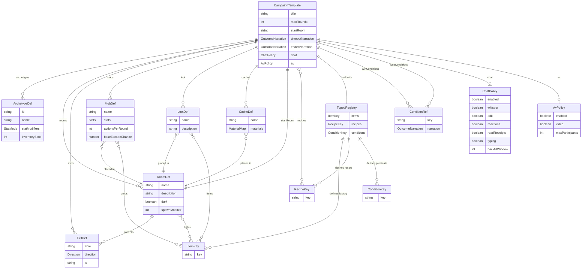
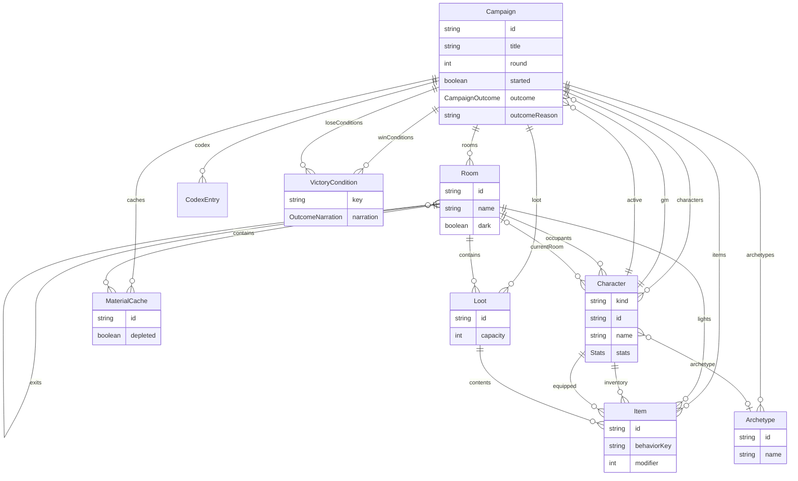

# Data model

A campaign exists in two shapes, and the difference is the heart of the authoring
design:

- A **campaign template** is what an author *writes* — a reusable, player-less
  world. Content is referenced by **name** (rooms, mobs, loot), and behaviors
  (item factories, recipes) are referenced by **typed registry key**. Items are
  not entities here; they are keys that containers point at.
- A **live campaign instance** is what *runs* — the template instantiated and
  played. Players have joined (so a party, a GM, and an active character appear),
  and every entity is a real object wired to others by **id**. This is exactly the
  shape the serialization layer persists in a `CampaignSnapshot`.

The same world, twice: authored as named content + registry keys, then realized as
an id-wired object graph.

## Campaign template (authoring)

What `authorTemplate(title, registry, opts)` accumulates and `.build()` assembles.
`ItemKey` / `RecipeKey` are entries in the `TypedRegistry` from `defineRegistry`,
and they are what `mob.drops`, `loot.items`, `room.lights`, and `.recipe()`
reference — compile-time-checked against the registered keys.

## Live campaign instance (runtime)

The object graph the engine plays and the serializer captures. Items are real
entities held by characters, stored in loot boxes, or placed as room light
sources; rooms link to rooms via directional exits; characters occupy rooms;
players carry an archetype. The campaign tracks its party, its GM, and the active
character.

## From template to instance

`instantiate(template)` clones a template snapshot with a fresh campaign id (the
world unchanged) to produce an instance genesis. Players then join via the
authoritative `joinCampaign` command — each bringing a `Character` and choosing one
of the template's archetypes — and the GM begins via `beginCampaign`. The
named-content + typed-keys template becomes the id-wired, player-populated instance
above.
