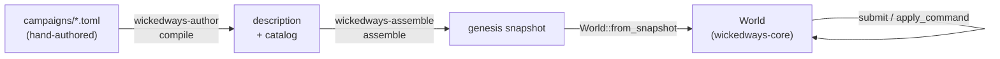

# Getting Started

This is the long-form tour: every concept in the engine, with real code you can
run. It's meant to be read start to finish once, then dipped back into. If you
just want the reference tables — every field of every struct — the
[Architecture](./architecture) page has them. This page is the story that makes
those tables make sense.

Nothing here is pseudocode. Every Rust snippet was executed against the engine
while writing this page, and the printed values you see are the real output.

## What you need

The engine and the shipped web client are Rust. You need a
[Rust toolchain](https://rustup.rs) — the exact version is pinned by
`rust-toolchain.toml`, so rustup picks it up automatically.

```bash
git clone https://github.com/daniel0mullins/WickedWays.git
cd WickedWays
cargo test --workspace
```

That last command runs everything: the engine's unit tests, the author and
assembler golden gates, the sync gate, the room server's tests over real
websockets, and the web client's host tests. If it's green, you have a working
checkout.

To actually play it:

```bash
cargo install dioxus-cli --version 0.6.3   # must match dioxus in Cargo.lock
cd crates/wickedways-web
dx serve
```

Open the printed URL (default `http://127.0.0.1:8080`), pick a campaign from the
launcher, and you're in. For the full multiplayer stack — the room server
serving both the static bundle and the `/ws` endpoint on one port — the root
`Dockerfile` builds exactly that:

```bash
docker build -t wickedways .
docker run --rm -p 8080:8080 wickedways
```

## The five-minute mental model

A campaign starts life as a TOML file a human wrote, and ends up as a `World`
struct being mutated one command at a time. Four crates get it there:



Worth internalizing early, because it explains a lot of the design:

- **The description is the world's layout** — rooms, exits, mobs, where things
  are. **The catalog is the lookup tables** — item descriptors and behavior
  scripts. They're separate because the description says *what exists* and the
  catalog says *how things behave*.
- **The genesis snapshot is a save file that hasn't been played yet.** Same
  format as any other save. There's no separate "new game" representation.
- **`World` is the only thing that mutates.** Everything else in the pipeline is
  a pure function.

## Part 1 — Authoring a campaign

Campaigns are TOML. Here's a small but complete one; we'll use it for the rest
of the guide.

```toml
title = "A Small Haunting"
startRoom = "Foyer"

[[rooms]]
name = "Foyer"
description = "A cold hallway. Dust hangs in the air."

[[rooms]]
name = "Cellar"
description = "A low brick cellar, black as a throat."
dark = true

[[exits]]
from = "Foyer"
to = "Cellar"
direction = "south"
behavior = "cellar-door"
name = "cellar door"
initialState = { unlocked = false }

[[items]]
key = "cellar-key"
name = "Cellar Key"
keyCode = "cellar"

[[victory.win]]
key = "reached-cellar"
test = "first(party).room.name == 'Cellar'"
narration = "You descend, and the house lets you."

[behaviors.exit.cellar-door]
canPass = "stateGet('unlocked', false) || hasKey(actor, 'cellar')"
failMessage = "The cellar door won't budge - it's locked."
runScript = '''
  when !stateGet('unlocked', false) {
    set state.unlocked = true
    pass 'The cellar key turns; the cellar door swings open.'
  }
'''
```

A few conventions that will save you time:

- **Keys are camelCase, and every table is `deny_unknown_fields`.** A typo isn't
  ignored — it's a hard compile error. That's deliberate: a silently-dropped
  `startRoom` would be a miserable bug to chase.
- **Exits are one-directional.** The example above lets you go *down* into the
  cellar and never come back. Write the return leg yourself if you want one.
- **Absent means default.** Don't write `dark = false` — just omit it.
- **Multi-line script bodies use `'''…'''`.** Because TOML's triple-single-quote
  strings are literal, you can use `'single quotes'` freely inside them for DSL
  string literals, which is why all the examples do.

The shipped campaign, `campaigns/hollow-house.toml`, is the reference for
everything else — mobs, loot, NPCs, crafting, a villain deck. The
`author-campaign` skill in `.claude/skills/` generates this format from plain
language if you'd rather describe a house than type one.

## Part 2 — Compile and assemble

Two function calls take you from that text to a playable world.

```rust
use wickedways_author::compile;
use wickedways_assemble::{assemble, Seat};
use wickedways_core::world::World;

// 1. TOML -> description + catalog
let compiled = compile(toml_src).expect("compile");

// 2. description + catalog + who's playing -> genesis snapshot
let party = [Seat { name: "Rowan".into(), archetype: None }];
let genesis = assemble(&compiled.description, &compiled.catalog, &party)
    .expect("assemble");

// 3. snapshot -> World
let mut world = World::from_snapshot(genesis);
world.validate_mechanics(&compiled.catalog).expect("behaviors resolve");
```

`compile` returns a `CompiledCampaign { description, catalog }` — the exact pair
`assemble` wants. `assemble` takes a slice of `Seat`s: empty for a pristine
genesis, one for single-player, several for a table. **The first seat becomes
the GM.**

`validate_mechanics` is the load-time check that every behavior key in the world
actually resolves to something — a native behavior or a catalog script. Call it
once after loading; it's the difference between finding out about a typo'd
behavior key at load time and finding out when a player walks into that room.

### Errors are a list, not a surprise

The assembler deliberately doesn't stop at the first problem. Give it a campaign
with three unrelated mistakes and you get all three:

```rust
let err = assemble(&compiled.description, &compiled.catalog, &[]).unwrap_err();
println!("{err}");
```

```text
campaign failed to assemble (3 problems):
  - startRoom references undefined room 'Nowhere'.
  - mob 'Wraith' references undefined room 'Attic'.
  - mob 'Wraith' drop references unregistered item key 'ghost-key'.
```

This is a small thing that matters enormously when you're authoring. Fail-fast
would have you fixing one typo per compile cycle.

## Part 3 — The `World`, and what a snapshot is

`World` is the whole game state, and it's refreshingly boring:

```rust
pub struct World {
    pub characters: BTreeMap<CharacterId, CharacterSnapshot>,
    pub rooms: BTreeMap<RoomId, RoomSnapshot>,
    pub items: BTreeMap<ItemId, ItemSnapshot>,
    pub loot: BTreeMap<LootId, LootSnapshot>,
    pub material_caches: BTreeMap<MaterialCacheId, MaterialCacheSnapshot>,
    pub exits: BTreeMap<ExitId, ExitSnapshot>,
    pub campaign: CampaignCoreSnapshot,
    pub codex: Value,
    pub rng: Rng,
    pub supplied_dice: VecDeque<SuppliedDie>,
}
```

Note the `BTreeMap`s. They're sorted maps, not hash maps, and that's a
determinism decision: iteration order is the key order, always, on every machine.
Snapshot output is byte-identical as a result — which is what lets the golden
tests work at all.

There is **no `World::new()`**. The only way in is `from_snapshot`, and the way
out is `to_snapshot()`. Save/load isn't a feature bolted onto the engine; it's
the engine's front door.

```rust
let snapshot = world.to_snapshot();          // serialize to JSON, write to disk
let restored = World::from_snapshot(snapshot); // and back
```

One gotcha worth knowing: `to_snapshot()` derives the item list by
*reachability* — an item only appears if some container, room, or character
references it. Drop an item into the void and it won't be in the save. This is
intentional garbage collection, not a bug.

### Branded IDs

Every entity ID is its own type:

```rust
branded_id!(CharacterId);
branded_id!(RoomId);
branded_id!(ItemId);
branded_id!(LootId);
branded_id!(MaterialCacheId);
branded_id!(ExitId);
```

They're all one-field wrappers around `String`, but the compiler won't let you
pass a `RoomId` where a `CharacterId` goes. On the wire they're transparent —
a `CharacterId` serializes as a bare string, so JSON and save files stay
readable:

```rust
let id = CharacterId("abc-123".into());
assert_eq!(serde_json::to_string(&id).unwrap(), "\"abc-123\"");
```

Construct one with `CharacterId("pc".into())` or `.into()` from a `&str`. If
you've written TypeScript with branded types, this is the same idea with
actual enforcement.

## Part 4 — Turns, rounds, and the campaign lifecycle

The lifecycle functions all live on `World`, all take the catalog, and all take
a `&mut Vec<PresentationCue>` to push narration into:

```rust
let mut cues = Vec::new();
world.begin_campaign(&catalog, &mut cues)?;   // validates, starts round 1's hooks
world.next_player(&catalog, &mut cues)?;      // advance the active character
world.end_round(&catalog, &mut cues)?;        // round bookkeeping + outcome check
world.end_campaign(&mut cues)?;               // finish
```

That out-parameter pattern shows up everywhere: **the engine never prints, never
returns a rendered string, and never holds a callback.** It appends cues to a
vector you own, and your UI decides what a cue looks like.

The shape of a round:

- Each character acts. `next_player` records the current actor in
  `acted_this_round` and advances the index.
- When the index wraps past the end of the party, `end_round` fires
  automatically.
- `end_round` has a load-bearing order: run round-end hooks → tick the
  lights-out counter → **increment the round** → clear `acted_this_round` →
  resolve the outcome. If the campaign just ended, it returns without starting
  the next round.
- Outcome resolution checks the loss list first, then the win list, then the
  `round >= maxRounds` ceiling (the timeout), then declares it ongoing.

Each character also has an **action budget** — `actionsPerRound`, default 3 for
players and 2 for mobs. Budgeted actions tick it; when it hits the cap, the turn
ends automatically. Some actions are deliberately free: equipping, unequipping,
opening, and talking don't cost you a turn. Taking damage is never an action —
getting hit doesn't use up your turn.

### Illegal moves throw

Try to do something the lifecycle forbids and you get a `ProceduralViolation`:

```rust
pub struct ProceduralViolation(pub String);
```

```rust
world.end_campaign(&mut cues).unwrap();
assert!(world.end_campaign(&mut cues).is_err()); // can't end it twice
```

This is a design stance, not an oversight. Illegal state transitions are loud.
And a warning if you're editing the engine: **some of those error strings are
replay-observable and pinned by the golden gates** — the message text is part of
the contract, so don't casually reword one.

## Part 5 — Intents, commands, and what comes back

There are two vocabularies, and the distinction trips people up.

**`Intent` is what a player wants.** It's what a UI produces — no actor field,
because the engine knows whose turn it is:

```rust
world.submit(Intent::Move { dir: Direction::South }, &catalog, &mut opened);
```

```json
{"kind":"move","dir":"north"}
{"kind":"wait"}
{"kind":"talk","npcId":"npc:Caretaker"}
```

**`Command` is what multiplayer sends.** Same tagged-union style, but every
reference is an explicit ID and there's an `actorId`, because the server has to
know who's asking:

```json
{"kind":"move","actorId":"c1","roomId":"r1"}
{"kind":"attack","actorId":"c1","targetId":"m1"}
{"kind":"nextPlayer"}
```

`submit` is the single-player front door, and it does the whole turn for you:
classify the intent → start the turn → dispatch it → run mob reactions →
advance to the next player. Free actions skip that wrapper.

What comes back is `ExecuteResult`:

```rust
pub struct ExecuteResult {
    pub cues: Vec<PresentationCue>,
    pub mob_attacks: Option<Vec<MobAttack>>,
    pub error: Option<String>,
}
```

Notice `submit` returns this struct rather than a `Result`. Rule violations come
back *inside* the value, in `error`, because "you can't do that" is a normal part
of playing a game, not an exceptional condition. `mobAttacks` is present
(possibly empty) on success and absent on the error path.

### Reject vs. fizzle — the distinction that matters

Watch what happens when our locked cellar door refuses to open:

```rust
let blocked = world.submit(Intent::Move { dir: Direction::South }, &catalog, &mut opened);
println!("error = {:?}", blocked.error);
println!("cues  = {}", serde_json::to_string(&blocked.cues).unwrap());
```

```text
error = None
cues  = [{"kind":"mechanic","cue":{"text":"The cellar door won't budge - it's locked."}}]
```

**No error.** The move was a perfectly legal thing to attempt; it just didn't
accomplish anything, and the door said so. That's a *fizzle*. Compare an actual
mistake:

```rust
let bad = world.submit(Intent::Take { target_id: "nope".into() }, &catalog, &mut opened);
// error = Some("You don't see that here.")
```

Keep those apart in your head — in multiplayer, a fizzle commits and replicates
like any other move, while a rejection never happened at all.

### Presentation cues

Cues are the engine's entire output vocabulary. Six kinds:

| Cue | When |
|---|---|
| `action` | any recorded action — move, pickUp, attack, … |
| `encounter` | a character enters a room with a live non-party occupant |
| `visibility` | a dark room's lit state flips |
| `resolution` | the campaign ends (won / lost / timed-out / ended) |
| `mechanic` | a mechanic or behavior emitted narration |
| `status` | a mechanic pushed status-bar fields |

```json
{"kind":"action","action":"move","actor":{"id":"c1","name":"Heir"}}
{"kind":"mechanic","cue":{"text":"You can't go that way."}}
```

Each carries an optional `sound` that's an *opaque* value — the engine never
looks inside it. The guiding line, straight from the source: *the engine emits
intent; the surface owns presentation.* The web client turns this same cue
stream into a full procedural audio layer without the engine knowing audio
exists.

## Part 6 — Stats, damage, and determinism

Three stats, and each is mitigated by another in a cycle:

| Damaged stat | Mitigated by |
|---|---|
| Health | Sanity |
| Sanity | Energy |
| Energy | Health |

The damage function is small enough to read in full:

```rust
pub fn compute_mitigated_damage(input: DamageInput) -> f64 {
    let mitigated_strength = (input.attack_strength - input.armor_sum).max(0.0);
    let damage_multiplier = (MAX_STAT - input.mitigator).max(0.0) * MITIGATION_PER_POINT;
    let light_multiplier = if input.light_averse && input.room_lit {
        LIGHT_VULNERABILITY
    } else {
        1.0
    };
    mitigated_strength * damage_multiplier * light_multiplier
}
```

with `MAX_STAT = 10.0`, `MITIGATION_PER_POINT = 0.2`, `LIGHT_VULNERABILITY = 1.5`.

Real numbers, actually computed:

```rust
// 10 strength, no armor, a fully-rested mitigator (10)
compute_mitigated_damage(DamageInput {
    attack_strength: 10.0, armor_sum: 0.0, mitigator: 10.0,
    light_averse: false, room_lit: false,
}) // => 0.0   — a healthy mitigator absorbs everything

// 10 strength, 2 armor, a half-spent mitigator (5)
// => 8.0

// 10 strength, no armor, a depleted mitigator (0), light-averse in a lit room
// => 30.0
```

That spread — 0 to 30 from the same attack — is the whole combat design in one
line. Wearing your stats down is how the house kills you.

If you're modifying this: **the IEEE-754 operation order is load-bearing.** The
replay goldens pin these results byte-for-byte, so don't reassociate the
arithmetic even when it looks algebraically identical.

### Randomness, and why there's exactly one source

Dice are a pure function; the randomness is injected:

```rust
pub fn roll(sides: u32, unit: f64) -> u32 {
    (unit * f64::from(sides)) as u32 + 1
}

assert_eq!(roll(6, 0.0), 1);
assert_eq!(roll(6, 0.999), 6);
```

The stream itself is a seeded mulberry32 living on `World.rng`:

```rust
let mut rng = Rng::seeded(1);
rng.next_f64() // => 0.6270739405881613, every time, on every platform
```

**Every draw in the engine goes through `World.rng`.** Not "most" — every one.
That, plus the absence of any clock or wall-time access anywhere in the engine,
is what makes a replay a replay: same genesis plus same command list equals the
same final state, byte for byte, which is exactly what the golden gates assert.

`World.draw_die(sides)` is the single seam, and it has a nice trick — a queue of
`SuppliedDie` values takes priority over the RNG, so a physical tabletop can feed
real dice rolls into the engine:

```rust
world.supplied_dice.push_back(SuppliedDie { sides: 20, value: 17 });
assert_eq!(world.draw_die(20), 17);  // the physical die wins
assert!((1..=20).contains(&world.draw_die(20))); // queue empty -> back to rng
```

Combat reads that d20 with the convention you'd expect: 20 is a crit (1.5×), 1 is
a critical miss, 2–5 miss, everything else hits.

## Part 7 — Behaviors: the pattern the whole engine repeats

This is the single most important pattern to understand, because seven different
systems use it identically. Every extensible family has:

1. **A trait** — the thing a behavior can do.
2. **A native registry** — a `key -> &'static dyn Trait` lookup for behaviors
   compiled into the engine.
3. **A `Resolved*` enum** — `Native` or `Scripted`, falling back to the catalog.
4. **Load-time validation** in `validate_mechanics`.

The seven families: `MechanicOp`, `ExitBehavior`, `SceneBehavior`,
`VictoryConditionBehavior`, `ItemBehavior`, `FormationBehavior`, `CardBehavior`.

Exits are the clearest example. The trait:

```rust
pub trait ExitBehavior: Sync {
    /// `canPass` — all preconditions pass (read-only).
    fn can_pass(&self, actor: &CharacterView, state: &Value) -> bool;
    /// `runScript` — run on a successful pass; may mutate `state`; returns a
    /// one-time narration line.
    fn run_script(&self, _actor: &CharacterView, _state: &mut Value) -> Option<String> { None }
    fn pass_message(&self) -> Option<&str> { None }
    fn fail_message(&self) -> Option<&str> { None }
}
```

A native implementation is just a zero-sized struct and a `static`:

```rust
pub struct KeyedDoor;
pub static KEYED_DOOR: KeyedDoor = KeyedDoor;

impl ExitBehavior for KeyedDoor {
    fn can_pass(&self, actor: &CharacterView, state: &Value) -> bool {
        door_can_pass(state, actor.has_item(DOOR_KEY))
    }
    fn run_script(&self, actor: &CharacterView, state: &mut Value) -> Option<String> {
        door_run_script(state, actor.has_item(DOOR_KEY))
    }
    fn pass_message(&self) -> Option<&str> { Some("You pass through.") }
    fn fail_message(&self) -> Option<&str> { Some("The door is locked.") }
}
```

And the resolver ties native and scripted together:

```rust
pub fn resolve_exit_behavior<'a>(key: &str, cat: &'a Catalog) -> Option<ResolvedExitBehavior<'a>> {
    if let Some(b) = exit_behavior(key) {
        return Some(ResolvedExitBehavior::Native(b));
    }
    match cat.behaviors.get(key) {
        Some(BehaviorScript::Exit { script }) =>
            Some(ResolvedExitBehavior::Scripted(ScriptedExit { script })),
        _ => None,
    }
}
```

Three details that are easy to miss and matter:

- **Native wins first.** A campaign script can never shadow a compiled-in
  behavior key.
- **The family tag must match.** A catalog entry of the wrong family under the
  right key resolves to `None`, not to a wrong-shaped behavior.
- **`Scripted` borrows the AST** rather than cloning it, so resolving a behavior
  at a fire point costs nothing.

There's exactly one deliberate exception to the strictness, and it's worth
knowing: **item behaviors validate weaker than everything else.** An item's
`behavior_key` doubles as its catalog descriptor key, and most items have no
behavior at all — so a missing behavior entry is legal. Only an explicit
item-family script gets shape-checked. If it were strict, every plain sword in
the game would fail to load.

## Part 8 — The ops DSL

You saw a script in Part 1. Here's what it actually is: a closed, loop-free,
deterministic data-AST, interpreted by the engine. Not an embedded scripting
language — there's no `eval`, no host calls, no way to reach the engine's
internals.

The author writes infix text in TOML:

```toml
[behaviors.mechanic.dread]
init = {}
onTurnStart = '''
  guard !hasEquipped(actor, 'lantern')
  emit adjustStat(actor, sanity, -1)
'''
modifyDamage = "damage.amount > 3 ? final 3 : damage.amount"

[behaviors.mechanic.dread.actions]
brace = '''
  emit cue('You brace against the dread.')
  emit adjustStat(actor, sanity, 1)
'''
```

`wickedways-author` compiles that into JSON that rides in the catalog. Our
cellar door becomes:

```json
{"family":"exit","script":{
  "canPass":{"kind":"bin","op":"or",
    "left":{"kind":"stateGet","field":"unlocked","default":false},
    "right":{"kind":"hasKey","keyCode":"cellar","of":{"kind":"actor"}}},
  "failMessage":"The cellar door won't budge - it's locked.",
  "runScript":[{"kind":"when",
    "cond":{"kind":"not","expr":{"kind":"stateGet","field":"unlocked","default":false}},
    "then":[
      {"kind":"setState","field":"unlocked","value":{"kind":"lit","value":true}},
      {"kind":"pass","value":{"kind":"lit","value":"The cellar key turns; the cellar door swings open."}}]}]}}
```

**What you can write.** Statements are `guard`, `when`, `set`, `emit`, and
`pass`. Values are `bool | number | string | list | null`. Expressions get
arithmetic (`+ − × ÷`), comparisons, `&&`/`||`/`!`, a ternary, field access,
and a fixed vocabulary of calls: `stateGet`, `stateGetIn`, `lookup`, `has`,
`some`, `every`, `includes`, `length`, `first`, `str`, `concat`, `defined`,
`hasKey`, `hasItem`, `hasEquipped`. The bare subjects you can name are `actor`,
`party`, `round`, `maxRounds`, `damage`, `action`, and `element`. Anything else
is a compile error.

**What you deliberately cannot write.** No loops, no variables, no user
functions, no recursion. `some`/`every` are the only iteration and they're
bounded by the list. `element` is the language's only binding. This is what makes
the interpreter *total* — it cannot panic, cannot hang, and cannot fail: missing
or ill-typed reads resolve to null or a default rather than erroring.

`guard` is a short-circuit, not a rollback: a falsy guard halts the body but
**keeps the effects already accumulated**. A `guard` nested inside a `when` halts
the whole body.

Because the interpreter is total, load-time validation only has three authoring
mistakes to catch: a `pass` in an effect body, an `emit` in an exit script, and a
`lookup`/`has` whose operand isn't a map literal.

The payoff of native and scripted sharing one trait: the `dread` mechanic above
is behaviorally identical to a hand-written Rust `MechanicOp` in the engine's
own conformance suite. Same trait, same hooks, same effects — one is compiled,
one is data.

## Part 9 — Mechanics and the effect vocabulary

Mechanics are how a campaign layers on rules — a dread counter, a sanity
spiral — without touching engine internals. `MechanicOp` has six hooks:

```rust
pub trait MechanicOp: Sync {
    fn init_state(&self, config: &Value) -> Value;
    fn on_round_start(&self, cx: &mut HookCtx<'_>) -> Vec<Effect> { Vec::new() }
    fn on_round_end(&self, cx: &mut HookCtx<'_>) -> Vec<Effect> { Vec::new() }
    fn on_turn_start(&self, cx: &mut TurnCtx<'_>) -> Vec<Effect> { Vec::new() }
    fn on_turn_end(&self, cx: &mut TurnCtx<'_>) -> Vec<Effect> { Vec::new() }
    fn on_action(&self, cx: &mut ActionCtx<'_>) -> Vec<Effect> { Vec::new() }
    fn modify_damage(&self, d: &DamageView, cx: &mut HookCtx<'_>) -> TransformResult { … }
    fn run_action(&self, action_key: &str, cx: &mut ActionCtx<'_>) -> Option<Vec<Effect>> { None }
}
```

Hooks fall into two shapes. **Reducers** react to lifecycle events and return
effects. **`modify_damage` is a transformer** — it intercepts an in-flight damage
number and can either pass a value along the chain or return `final` to lock it
and stop.

Crucially, mechanics can't reach raw setters. They return values from a **closed
union of eight effects**: `damage`, `heal`, `adjustStat`, `grantImmunity`, `cue`,
`status`, `giveItem`, `setVisible`. That's the entire surface. The engine
collects effects from every mechanic, *then* applies them in one pass — so no
mechanic can observe another's effects mid-event, which keeps application order
deterministic.

Three guardrails hold it together: the closed effect union (integrity), a
read-only view with no engine handles, clock, or IO and all randomness from the
injected RNG (determinism), and a hard cap of `MAX_EFFECTS_PER_EVENT = 64` per
mechanic per event that throws rather than looping forever (termination).

## Part 10 — Multiplayer

Multiplayer is a command log with one writer. Two types carry it:

```rust
pub struct LogEntry { pub seq: u64, pub base_seq: u64, pub command: Command, pub delta: Delta }

pub enum SubmitResult {
    Committed { seq: u64, delta: Delta },
    Denied { reason: String },
}
```

`SyncAuthority` is the single writer. Its `submit` is worth memorizing because
the ordering is the whole safety story:

**authorize → apply (restoring a backup if the engine throws) → diff the
before/after snapshots → assign `seq` → append to the log.**

The delta isn't hand-written per action — it's a *structural diff* of the
snapshot before and after. That's why there's no per-command sync code to keep in
sync with per-command game code.

```rust
let mut authority = SyncAuthority::new(world, catalog, AuthorityOpts {
    manage_turns: true,
    ..Default::default()
});

match authority.submit(Command::NextPlayer) {
    SubmitResult::Committed { seq, delta } => { /* seq == 1 on the first commit */ }
    SubmitResult::Denied { reason } => { /* wrong turn, bad lifecycle, … */ }
}
```

`seq` is the monotonic commit number, starting at 1. `base_seq` is always
`seq - 1` — the state the delta was computed against — which lets a client prove
it isn't missing an entry. Clients skip anything `seq <= head` (a duplicate,
including the echo of their own commit) and buffer anything `seq > head + 1`
(a gap) until the missing entry arrives.

Clients run a `SyncCoordinator` that owns a **replica** world:

```rust
let mut a = SyncCoordinator::join(&transport);
let mut b = SyncCoordinator::join(&transport);

a.submit(&mut transport, Command::NextPlayer);
assert_ne!(b.snapshot(), a.snapshot());  // b hasn't synced yet
b.sync(&transport);
assert_eq!(b.snapshot(), a.snapshot());  // b converges to a
```

The coordinator **never resolves commands and never optimistically mutates.**
State changes only when an authoritative delta arrives. That means no rollback
code, no conflict resolution, and no compare-and-swap — the two hardest things in
multiplayer simply don't exist here. The cost is a round trip before you see your
own move; the benefit is that replicas cannot diverge.

The delta applier reinforces it: applying a delta patches state and **never draws
RNG or runs game logic**. Replicas carry zero determinism burden, because they
don't compute anything.

Everything talks through one small trait, so single-player and networked play are
the same code path:

```rust
pub trait SyncTransport {
    fn head(&self) -> u64;
    fn submit(&mut self, command: Command) -> SubmitResult;
    fn entries_since(&self, from_seq: u64) -> Vec<LogEntry>;
    fn load_snapshot(&self) -> (u64, CampaignSnapshot);
}
```

`InProcessTransport` wraps a local authority; the websocket transport forwards to
the room server. Same shape either way.

## Part 11 — The wasm seam

`wickedways-wasm` exposes a stateful handle to JavaScript. The rule is simple:
**only JSON strings cross the boundary.** Engine objects never leave Rust.

```rust
#[wasm_bindgen(constructor)]
pub fn new(genesis_json: &str, catalog_json: &str, seed: u32) -> Result<Authority, JsValue>;

pub fn submit(&mut self, intent_json: &str) -> Result<String, JsValue>;
pub fn snapshot(&self) -> Result<String, JsValue>;
pub fn restore(&mut self, snapshot_json: &str) -> Result<(), JsValue>;

#[wasm_bindgen(js_name = takeStartupCues)]
pub fn take_startup_cues(&mut self) -> Result<String, JsValue>;

#[wasm_bindgen(getter)] pub fn finished(&self) -> bool;
#[wasm_bindgen(getter)] pub fn outcome(&self) -> String;
```

From JavaScript that reads exactly as you'd hope:

```js
const auth = new Authority(genesisJson, catalogJson, 0x7e57);
const startup = JSON.parse(auth.takeStartupCues());
const res = JSON.parse(auth.submit('{"kind":"wait"}'));
const save = auth.snapshot();
auth.restore(save);
auth.finished;   // property, no parentheses
auth.outcome;    // "ongoing"
```

`Result<T, JsValue>` means "return on `Ok`, **throw** on `Err`" — and the split
is deliberate: a *rules* failure comes back inside the JSON as `error`, and only
genuinely malformed input throws. Same philosophy as `ExecuteResult`.

One detail with real consequences: `restore` **carries the RNG stream across**,
because loading a save must not reset the dice.

## Part 12 — The room server

`wickedways-server` is axum, and each campaign is an **actor**: one tokio task
owning its `Table`, fed by a message channel. Game state has no mutex on it,
because only one task ever touches it. Requests to the same campaign serialize
naturally.

The wire protocol lives in its own engine-free crate so client and server can't
drift. Messages are tagged with `t`, and `command`/`delta`/`snapshot` are
**opaque** to the server — it orders and relays them without understanding the
engine:

```json
{"t":"join","campaignId":"camp","token":"tok","fromSeq":0}
{"t":"submit","campaignId":"camp","command":{"kind":"nextPlayer"}}
{"t":"committed","seq":2,"delta":{"changed":[]}}
{"t":"entry","entry":{"seq":2,"baseSeq":1,"command":{"kind":"nextPlayer"},"delta":{}}}
{"t":"denied","reason":"not your turn"}
```

The fan-out rule after a commit: **the submitter gets `committed`, everyone else
gets `entry`.** Same sequence number, same delta.

Authorization has one nice property worth copying. The acting seat is derived
from the *command itself*, never from the client's envelope:

```rust
pub fn may_act(&self, identity: &str, actor: &Actor) -> bool {
    match actor {
        Actor::Character { actor_id } => self.owner_of(actor_id) == Some(identity),
        Actor::Gm => identity == self.gm_identity,
        // self-claim: allowed only for an unowned seat (no hijack).
        Actor::Join { character_id } => self.owner_of(character_id).is_none(),
    }
}
```

There's nothing to forge, because the client never states who it is.

Persistence is SQLite, and it's **flush-before-ack**: the server writes the
snapshot and membership in one atomic row-upsert *before* acknowledging the
commit. If the write fails, it reloads from disk and denies the command rather
than acknowledging something it didn't persist.

## Part 13 — Goldens, and how to change behavior on purpose

Four gates pin the engine's output against committed files: the author gate
(TOML → description + catalog), the assembler gate (→ genesis), the replay gate
(a step-by-step replay of recorded command streams), and the sync gate (deltas).

These are **regression pins of the engine's own output**, not hand-written
expectations. So when you intentionally change behavior, you regenerate them:

```bash
UPDATE_GOLDENS=1 cargo test -p wickedways-author   --test gate
UPDATE_GOLDENS=1 cargo test -p wickedways-assemble --test goldens
UPDATE_GOLDENS=1 cargo test -p wickedways-assemble --test replay_gate
UPDATE_GOLDENS=1 cargo test -p wickedways-assemble --test sync_gate
```

Then **read the diff like code** and commit it in the same change. Three rules:

- Regeneration is deterministic — running it twice must produce a zero git diff.
- Never hand-edit a golden.
- If a golden changed and you didn't expect it to, that's the gate doing its job.
  Go find out why.

When a gate fails it prints the first differing JSON pointer rather than dumping
a 200 KB diff, which makes this much less painful than it sounds.

## Where to go next

- **[Architecture](./architecture)** — the full reference: every mechanic, every
  field, combat and crafting and equipment in complete detail.
- **`campaigns/hollow-house.toml`** — the shipped campaign, and the best example
  of the author format under real load.
- **`.claude/skills/author-campaign/`** — generates campaign TOML from a plain
  description, with `references/format.md` as the per-table schema and
  `references/dsl.md` as the DSL grammar.
- **`conformance/fixtures/README.md`** — what each class of golden file is for.
- **`crates/wickedways-core/src/world/`** — the engine itself. Start at `mod.rs`,
  then `turn.rs`, then `submit.rs`; that's the spine.
